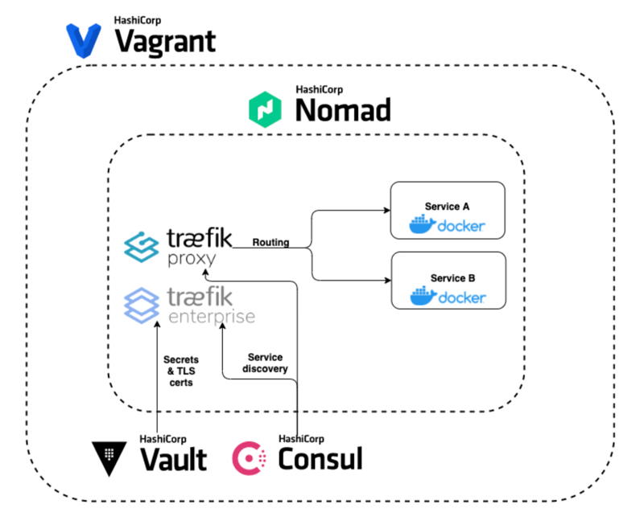

# Simplifying Infrastructure and Networking Automation with HashiCorp and Traefik

This repository is the companion material for the [Simplifying Infrastructure and Network Automation with HashiCorp and Traefik](https://info.traefik.io/webinar-hashicorp-traefik-infrastructure-automation) webinar.

In this event, we demonstrate how to:
- Use Traefik as the ingress gateway in Nomad
- Leverage Traefik’s Consul Catalog provider for dynamic configuration
- Integrate Traefik with Consul Connect for service mesh capabilities
- Manage TLS certificates in Traefik Enterprise using Vault’s PKI engine and KV store



## Getting Started

You can use Vagrant to set up the lab environment used in this webinar. Vagrant is
a tool for building and managing virtual machine environments.

~> **NOTE**: To use the Vagrant environment, first install Vagrant following
these [instructions](https://www.vagrantup.com/docs/installation/). You also
need a virtualization tool, such as [VirtualBox](https://www.virtualbox.org/).

From a terminal in this folder, you may create the virtual machines with the `vagrant up` command.

```shell-session
$ vagrant up
```

This takes a few minutes as the base Ubuntu box must be downloaded
and provisioned with Docker, Nomad, Consul, and Vault. Once this completes, you should see this output.

```plaintext hideClipboard
Bringing machine 'primary' up with 'virtualbox' provider...
Bringing machine 'secondary' up with 'virtualbox' provider...
==> primary: Importing base box 'hashicorp/bionic64'...
...
==> primary: Running provisioner: shell...
```

Once this provisioning completes, use the `vagrant ssh` command to start a shell session on it.

```shell-session
$ vagrant ssh
```

If you connect to the virtual machine properly, you should find yourself at a
shell prompt for `vagrant@traefik-webinar-1:~$`

Please note that in this lab environment Nomad, Consul, and Vault are configured in `dev` mode. This mode is useful for developing or testing because it doesn't require any extra configuration, and does not persist any state to disk.

**Warning**: Never run -dev mode in production.

## Accessing the environment

You may view the Nomad, Consul, and Vault interfaces with a web browser. Please access here:
- Nomad UI http://localhost:4646/
- Consul UI http://localhost:8500/
- Vault UI http://localhost:8200/

Note: If any of these do not work, please check your Vagrant output. If there is a port collision on your system Vagrant may assign a different port.

## Demo

### Nomad

Will be shown together with Consul below.

### Consul

#### Consul Catalog

```bash
nomad run jobs/whoami.nomad
nomad run jobs/traefik.nomad

nomad status

curl localhost/whoami
```

Visit http://localhost:8080/whoami from your desktop. Take note of the value `RemoteAddr`.

#### Consul Connect

```bash
nomad run jobs/countdash.nomad
```

Visit http://localhost:9002/ from your desktop. You should see a dashboard showing Connected and displaying an incrementing counter.

```bash
nomad run jobs/whoami-connect.nomad

nomad status

curl localhost/whoami
```

Visit http://localhost:8080/whoami from your desktop. Take note of the value `RemoteAddr`. What is it now? What was it before? What's changed and why?

### Set up TraefikEE

NOTE: These steps require a Traefik Enterprise license. If you don't have a license, you may request a free 30-day trial [here](https://info.traefik.io/get-traefik-enterprise-free-for-30-days).

These steps begin from your desktop machine, not the vagrant host.

You'll need to download `teectl` using the appropriate download link at https://doc.traefik.io/traefik-enterprise/installing/teectl-cli/. (Please note that on recent versions of macOS, you will need to Allow it to run in the Security & Privacy System Preferences.)

Run the following command to create the bundle.zip:

```bash
teectl setup --onpremise.hosts="192.168.88.4,192.168.88.5" --cluster nomad --force
```

Next we will transfer the bundle.zip to the primary vagrant host. To accomplish this use the [vagrant scp](https://github.com/invernizzi/vagrant-scp) plugin to transfer the file with the command:

```bash
vagrant scp bundle.zip /home/vagrant/bundle.zip
```

Alternatively, you can uncomment [line 105](https://github.com/traefik-tech-blog/hashicorp-webinar/blob/master/Vagrantfile#L105) in the Vagrantfile and then run `vagrant reload --provision`. The Vagrant reload will take several minutes.

Use the `vagrant ssh` command to start a shell session on it.

If you connect to the virtual machine properly, you should find yourself at a
shell prompt for `vagrant@traefik-webinar-1:~$`

```bash
export TRAEFIKEE_LICENSE=<your license key>

# stop previous jobs
nomad stop traefik
nomad stop countdash
nomad stop whoami

# move bundle.zip to controller data volume
sudo mv ./bundle.zip /opt/traefikee/

# create vault secrets for traefikee license and plugin registry token (assuming your license is the TRAEFIKEE_LICENSE environment variable)
vault kv put secret/traefikee/license license_key=$TRAEFIKEE_LICENSE
vault kv put secret/traefikee/plugin token=$(openssl rand -base64 10)

# run traefikee nomad job
nomad job run jobs/traefikee.nomad

# get controller alloc ID
nomad status traefikee

# update with actual ALLOC_ID value
export CONTROLLER_ALLOC_ID=$ALLOC_ID

# get proxy join token
nomad alloc exec -i -t -task controllers $CONTROLLER_ALLOC_ID /traefikee tokens --socket local/cluster.sock
# export provided TRAEFIKEE_PROXY_TOKEN

# add proxy token to vault
vault kv put secret/traefikee/proxy token=$TRAEFIKEE_PROXY_TOKEN

# verify all nodes are running (outside of VM)
teectl get nodes
```

### Vault PKI

```bash
# Enable Vault PKI and create role (inside VM)
vault secrets enable pki

vault write pki/root/generate/internal common_name="VAULT PKI CERT"
vault write pki/roles/traefikee allowed_domains=localhost allow_bare_domains=true allow_subdomains=true max_ttl=10h

# apply static and dynamic config (outside of VM)
teectl apply --file traefikee/static.yaml
teectl apply --file traefikee/dynamic.yaml

# update whoami job (inside of VM)
nomad run jobs/whoami-tls.nomad

# curl and note TLS certificate
curl -kv https://localhost:443/whoami
```

### Vault TLS KV Store

```bash
# generate self-signed certificate
openssl req -x509 -newkey rsa:2048 -keyout localhost.key.pem -out localhost.cert.pem -nodes -subj '/CN=localhost'

# Add TLS cert to Vault KV store
vault kv put secret/localhost cert="$(cat localhost.cert.pem | base64 -w0)" key="$(cat localhost.key.pem | base64 -w0)"

# update whoami job
nomad run jobs/whoami-tls.nomad

# curl and note TLS certificate
curl -kv https://localhost:443/whoami
```

## Cleaning up

### Halt the VMs

Exit any shell sessions that you made to the virtual machine. Use the `vagrant halt` command to stop the
running VMs.

```shell-session
$ vagrant halt
```

At this point, you can start the VMs again without having to provision it.

### De-provision the VMs

If you don't anticipate using the training VMs for a while, and don't mind the
time necessary to provision them, you can deprovision the VMs. From this folder,
use the `vagrant destroy` command to deprovision the environment your created.
The command verifies that you intend to perform this activity; enter `Y` at both
prompts to confirm that you do.

```shell-session
$ vagrant destroy
```

```plaintext
    secondary: Are you sure you want to destroy the 'secondary' VM? [y/N] y
==> secondary: Forcing shutdown of VM...
==> secondary: Destroying VM and associated drives...
    primary: Are you sure you want to destroy the 'primary' VM? [y/N] y
==> primary: Forcing shutdown of VM...
==> primary: Destroying VM and associated drives...
```

De-provisioning the environment deletes the VMs that were created based on the base
box.

### Remove the base box

If you don't intend to use the Vagrant environment ever again, you can also
delete the downloaded Vagrant base box used to create the VM by running the
`vagrant box remove` command. Don't worry, if you decide to use the environment
again later, Vagrant re-downloads the base box when you need it.

```shell-session
$ vagrant box remove hashicorp/bionic64
```

```plaintext
Removing box 'hashicorp/bionic64' (v1.0.282) with provider 'virtualbox'...
```

At this point, you have removed all of the parts that are added by starting up
the Vagrantfile.

## Documentation and References
- [Traefik](https://doc.traefik.io/traefik/)
- [Introduction to Consul](https://learn.hashicorp.com/tutorials/consul/get-started?in=consul/getting-started)
- [Introduction to Vault](https://learn.hashicorp.com/tutorials/vault/getting-started-intro?in=vault/getting-started)
- [Introduction to Nomad](https://learn.hashicorp.com/tutorials/nomad/get-started-intro?in=nomad/get-started)
